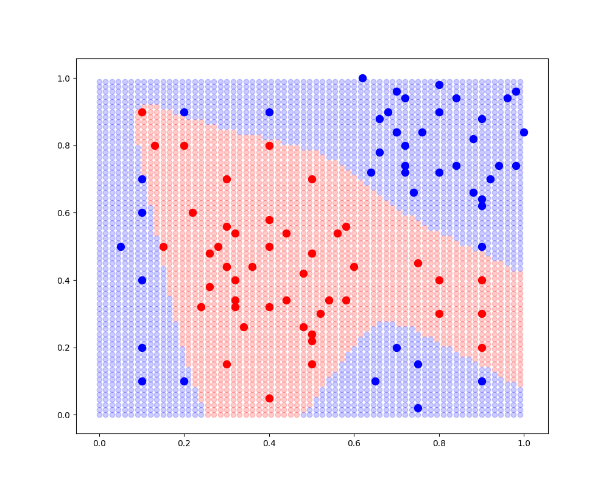
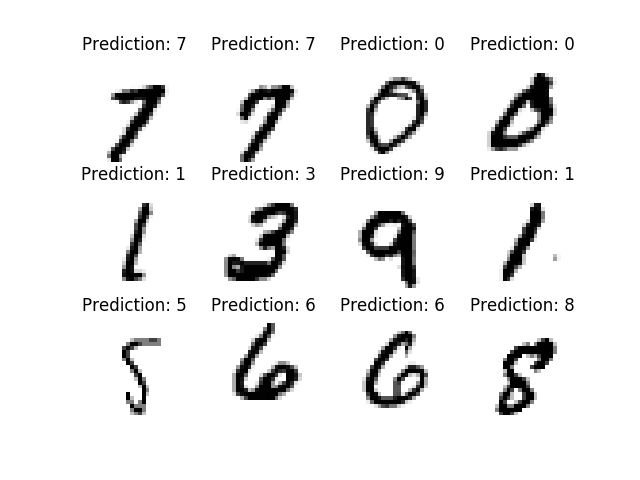

# ai
Collection of some ai projects

## neural network
My own implementation of a Feed Forward Neural Network with one hidden layer. You can choose the number of units in the hidden layer and the learning rate.

### classification

### image recognition

